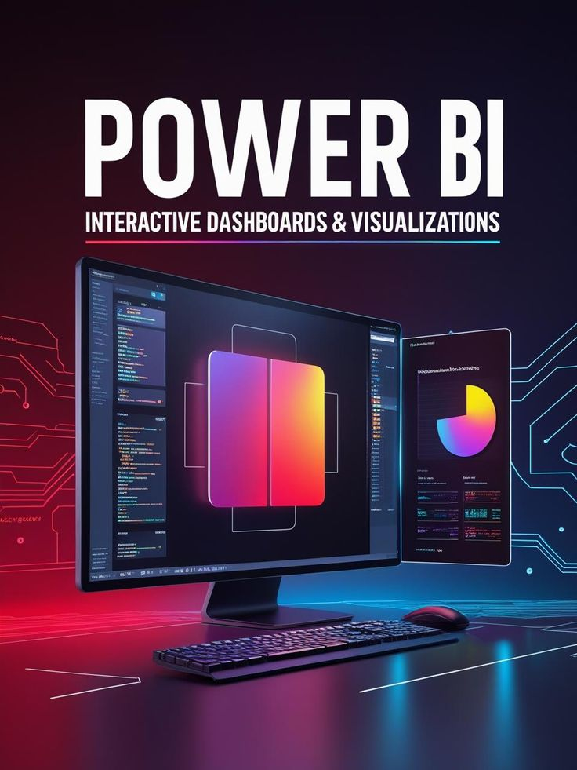

# Power BI Projects

# **📌 Description**

This repository contains a collection of Power BI dashboard projects focused on transforming raw data into interactive visualizations and actionable business insights. The dashboards demonstrate practical applications of data analysis, reporting, and business intelligence techniques using real-world datasets.

The projects showcase end-to-end dashboard development workflows, including data cleaning, data modeling, DAX calculations, and visualization design to support data-driven decision-making. These dashboards highlight strong skills in data storytelling, KPI tracking, and performance analysis.

# **🚀 Key Features**

📊 Interactive dashboards and reports

🔄 Data cleaning and transformation using Power Query

🧩 Data modeling and relationships

📐 DAX calculations and measures

📈 KPI and performance analysis

📉 Business intelligence reporting

🗂️ Real-world dataset visualization

# **🛠️ Technologies Used**

📊 Power BI,   🔄 Power Query,   📐 DAX (Data Analysis Expressions),   🧩 Data Modeling,   📈 Data Visualization,   📂 Excel / CSV / SQL  
