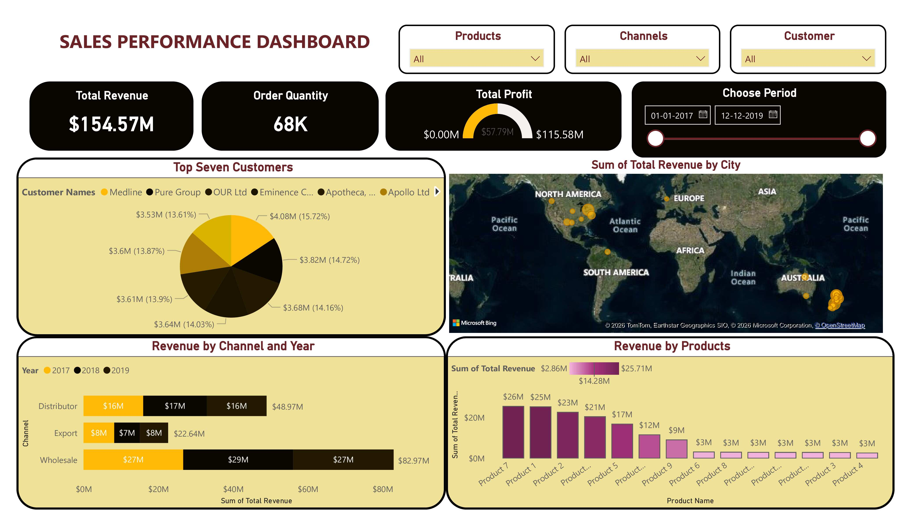

# 🚀 Sales Performance Dashboard | Power BI

This project demonstrates an interactive Sales Performance Dashboard built using Power BI to analyze sales data across customers, products, channels, and regions.

**📊 Features**

Revenue, Profit, and Order Quantity KPIs

Customer-wise and Product-wise performance analysis

Channel and Year-based revenue comparison

Geographic visualization of revenue by city

Dynamic slicers for filtering insights

**🛠 Tools Used**

Power BI

DAX

Microsoft Excel

**📁 Dataset**

Sample sales dataset used for analytics and visualization practice.

This project showcases practical Power BI skills including data modeling, DAX measures, and dashboard storytelling.
